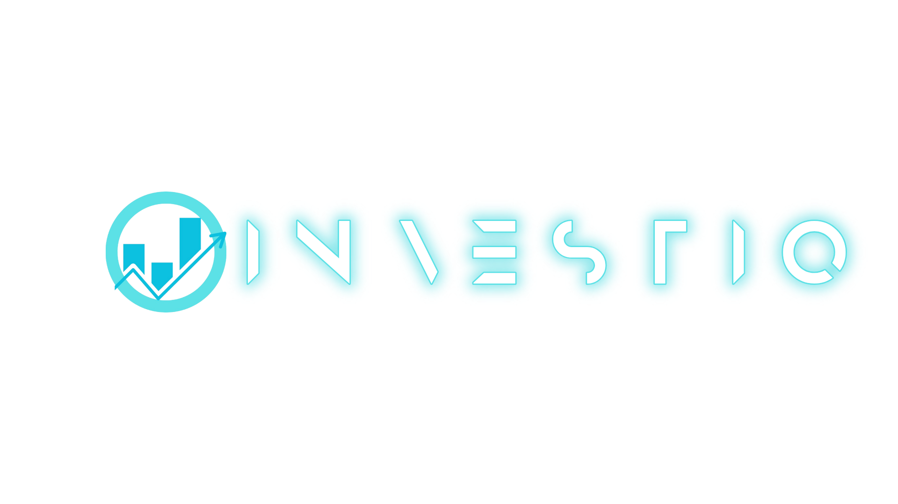
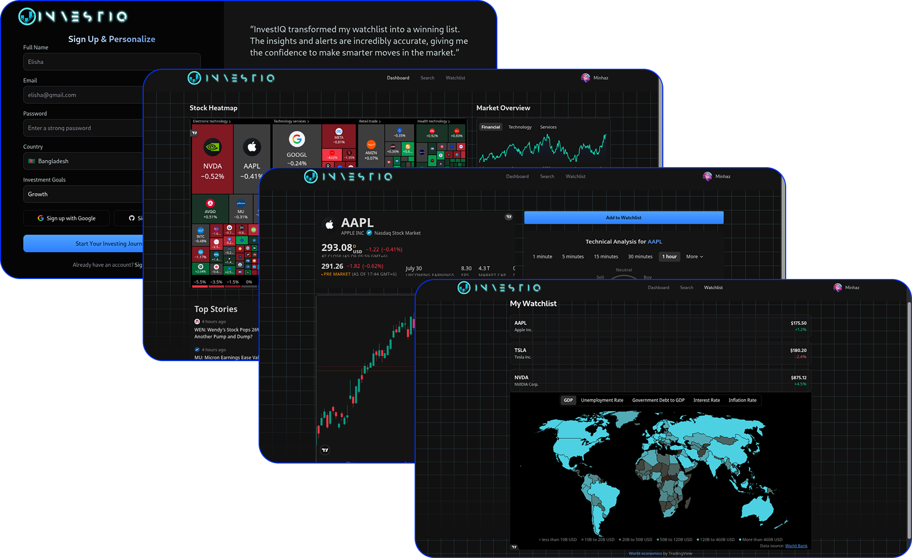
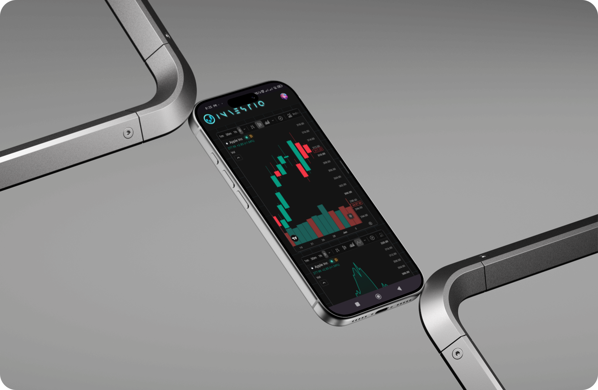

 <div align="center">
    
  </div>
  
## InvestIQ uses to access real-time market data via **Finnhub** API and **TradingView**.


  <div align="center">
  
  </div>
  
 
<div/>
 
  
 

### Features:
- User authentication  
- Real-time stock, crypto, and market data
- Analytics dashboards and charts
- Modular, component-driven architecture
## **3. Installation & Setup**
1. Clone the repository:
`git clone https://github.com/yourusername/investiq.git cd investiq`

2. Install dependencies:
`bun install`
3. Configure environment variables:
   
4.  Run the development server: 
`bun run dev`

5. Open [http://localhost:3000](http://localhost:3000) in your browser.

## **4. Environment Variables**
```
NODE_ENV=development
NEXT_PUBLIC_BASE_URL= 
# FINNHUB
FINNHUB_API_KEY= 
FINNHUB_BASE_URL= 
# MONGODB
MONGODB_URI=  

# BETTER AUTH
BETTER_AUTH_SECRET= 
BETTER_AUTH_URL= 
#AUTH
GOOGLE_CLIENT_ID= 
GOOGLE_CLIENT_SECRET= 

GITHUB_CLIENT_ID= 
GITHUB_CLIENT_SECRET=
```

  <div align="center">
  
  </div>
  <div align="center">
  
  </div>
  
## **7. Contributing**
1. Fork the repo
2. Make changes and commit:
3. Push and create a Pull Request
##  **9. License**

  

MIT License © 2025 Investiq
